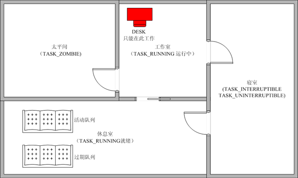

Linux内核是一个无比复杂的系统，要想看清大致的脉络也非易事。其实，可以把运行中的Linux想像成一个人类的社会，当中的进程就是社会中的人。人有生老病死，进程有创建、异常、终止。人有各种各样的财产，进程有对应的地址空间、设备等等。人被各种各样的东西限制着，被人管着，进程也是。内核无比巨大，从哪着手？我想，从进程的视角来看是个好办法。并且，在学习Linux内核的同时，类比人类社会来看，会有更深刻的印象，理解得更透彻。

本来也应该从进程的创建开始写的，但是最近在看调度的相关论文，就又把Linux调度的东西看了一下。所以，就先写调度相关的东西吧。

首先介绍与进程所在环境对应的人类场景：

这是一个公司，公司里有很多人（进程），每个人都有其对应的职称（优先级）。这个公司很奇怪，只有一张办公桌（CPU），在任意时刻，只能有一个人在工作(TASK_RUNNING正在运行状态)。其他人呢，要么在休息室时短暂地休息（对应TASK_RUNNING就绪状态），要么就在寝室Sleep(对应TASK_INTERRUPTABLE或TASK_UNINTERRUPTABLE)，要么就是死人了，在停尸间（TASK_ZOMBIE）。是的，这是真的，这个公司就是个血汗工厂，干活累死了，就直接丢进停尸间，惨绝人寰！

以下是此公司的平面图：

图解：“推门”是单向的：比如连接工作室和太平间的是推门，职员只能从工作室走到太平间，不能从太平间走到工作室（这太吓人了）。“凹槽门”是双向的：比如连接工作室和休息室的门是凹槽门，职员可以走来走去。

<strong>时间片</strong>(time slice)：这个公司的工资特别高，按工作的小时数计算。工作者得钱，不工作者不得钱。所以，所有的人都特想去办公桌那里工作，争着抢着要去。为了让大家都有机会去工作（避免有的人没钱拿，饿死，i.e. starve to death），所以公司出了条规定，每个人每次工作的时间不能超过公司分给自己的时间片（time slice）。时间片的大小由此人的职称决定。

<strong>职称</strong>（也就是内核中的priority）：职称有两种，一种是静态职称（static priority），一种是动态职称（dynamic priority）。静态职称是先天的，由此人的老爸决定（富二代有先天优势！）。动态优先级是看在公司里的工作表现的。职称是很重要的东西，职称越高，你到办公桌上赚钱的机会越大。

<strong><em>默认时间片长点好还是短点好？</em></strong>

<em>自然是不长不短好（世界上的事情都是这样）。如果太短了，比如说某职员时间片是1</em><em>分钟（对应的Linux</em><em>里的时间片应该差不多是0.1ms</em><em>吧，可能还得少点），这个人在办公桌前屁股没坐热就要走了，从起身到回到休息室，再到下一个人起身走到办公桌前坐下，这也得要一分钟。如果这样的话，这公司将有一半的时间花在走路上。这样搞是不行的，在资本主义社会，大家都要努力搞高生产率。</em><em> </em>

<em>那是不是时间片长了就好？也不是。比如时间片是一个小时，当两个客户（对应Linux</em><em>中的两个用户）同时要和此公司展开业务（对应Linux</em><em>中的启动进程），有两个职员会分别处理这两个业务。A</em><em>职员一上去就占着办公室一个小时，B</em><em>职员在这一个小时结束前没法子处理他的客户的业务，所以B</em><em>职员的客户就得在寒风中等一个小时！资本主义社会里的公司是不能让他们的财神爷不高兴的。所以，还是不长不短的好。</em>

<em> </em><em>回到真实的Linux</em><em>内核中:</em><em>很多人认为时间片过长会导致程序的响应（比如字处理程序的I/O</em><em>响应）变慢，因为要等时间片用完才能处理。其实不然，字处理程序等交互性强的程序,</em><em>他们的优先级高，可以抢占当前正在运行的进程，从而得到执行。在公司里，就比如B</em><em>职员的职称高，他可以把A</em><em>职员从办公桌上踢走。事实上，从后面对动态优先级的讨论我们可以看到，要是A</em><em>职员一直霸占着办公桌不走，他/</em><em>她的动态职称会变低的，结果是，在休息室里的其他职员的职称就自然而然地可能比A</em><em>高了。</em>

<strong>职员目录(Process list)</strong>：公司有个目录，在这个目录中，列出了所有公司的职员。这对应Linux里的Process List，里面存有所有进程的信息。
<h2>下面以Mr. P的经历为例说明</h2>
Personal History Statement of Mr. Process （Mr. P in short）<strong> </strong>
<h3>出生</h3>
这是世界上最怪异的公司，职员都是单性的，都是男的。并且不要交配，自己调用系统调用fork()，就可以生了。生出来的小孩子也都是男的。

在这里为了问题的简化，就只讨论与调度的关系比较紧密的内容。

图：详细的公司平面图

如上图所示，在休息室里其实还有两个沙发。一个沙发叫做活动队列（往后我们叫它<strong>活动沙发</strong>吧），一个沙发叫做过期队列（往后我们叫它<strong>过期沙发</strong>）。坐在活动沙发上的职员都还有时间片没有用完，坐在过期沙发上的职员的时间片刚刚被用完了（但他们手上都拿着新分配到的时间片，这个是2.5版内核新引入的O(1)调度，后面再讲）。

Mr. P的父亲在办公桌旁边工作的时候，突然fork()了一下，就生出了Mr.P。一出生，Mr. P就拥有和父亲一样的静态职称（static priority）。他一出生就坐在了活动沙发上，拿走了父亲一半的时间片。比如生MR. P之前，MR. P的父亲有10ms的时间片，MR.P出生后，他父亲有5ms，Mr. P有5ms。这样的机制是为了防止有人以生子来抢夺时间片：试想，有一人，自己有10ms的时间片，他一直生啊生，生了100个孩子，那么这个程序就有了10+10*100ms的时间片了。然后他的孩子断续生啊生，那么有可能系统中绝大部分的时间片都是他家的了，那他的街坊邻居还要不要活啊，没时间片等于不能做事，等于没工资，等于没食物，等于饿死。

另外，不幸的是，即使是在发达的资本主义社会，孩子也是有可能夭折的（由于各种原因，在第一次到办公桌上工作之前就死掉了）。在这种情况下，公司会把孩子没用的时间片还给他父亲。多么人性化的公司…
<h3>开始工作</h3>
像其他所有孩子一样，Mr. P一生下来就<strong>能</strong>工作了，他坐在活动沙发上等着做事。他人事部的同事Miss Schedule (以下简称Miss S)会在每个tick(内核的时间单位，时间很短)结束时检查一下以下两种情况有没有发生：
<ol>
	<li>在办公桌前工作的那个职员是不是已经用完自己的时间片了。</li>
	<li>是不是有更高动态职称（dynamic priority）的职员在活动沙发上等着。</li>
</ol>
其中一种情况成立，这个在办公桌前工作的那个职员就要被赶出来，换在活动沙发上坐着的动态职称最高的职员进去工作。

假设经过一段时间后，没有人的动态职称比Mr. P高了。在一个时间tick结束时，Miss S到休息室检查大家当前的职称。他能轻松地找到动态职称最高的职员(sched_find_first)，因为职员们都是按动态职称来坐的（在活动沙发上），动态职称相同的职员坐在一起（参考struct prio_array）。Miss S只要按顺序找下去，第一个在沙发上找到的职员就是职称最高的。当Miss S用上面的方法发现Mr. P当前的动态职称是最高的时，在办公桌前工作的是职员C，Miss S把C从办公桌前拉到休息室。如果此时C的时间片已经用完了，他就会被安排坐在过期沙发上（这也就是expired的含义）；如果此时C的时间片没有用完，他就会被安排坐在活动沙发上。C被拉到休息室时，他的工作用具，笔啊纸啊什么的，都要从办公桌上拿走（这是关于进程上下文切换的问题）。C走了之后，Mr. P带着他的东西到办公桌前坐下，整理好办工用品（进程上下文切换）。好的，Mr. P可以开始工作了。
<h3>评定动态职称</h3>
<strong>公司里的两类人：</strong>

<strong>交际花</strong>（I/O消耗型进程）：这类人常常与外部的客户打交道，而客户的反应总是不怎么快。所以，交际花常常要等客户做出反应。公司为了不让交际花在等客户反应的时候也占用着办公桌，所以，当交际花要等待客户的响应时，他就会被移到寝室去睡觉(Sleep)。

<strong>工作狂</strong>（处理器消耗型）：这类人就是传说中的苦干王，很少和外界打交道，就知道在办工桌上做事。这种工作狂给公司造成一些困扰，如果他们老占着办公桌，交际花就没法做事了。要知道，一个公司还是需要人去跑跑业务的。

公司有一套机制，这一套机制能很好的区分这两类人，并且给他们评定职称。判断的标准就是他们的平均睡眠时间（average sleep time）。睡眠时间包括在寝室里的时间（TASK_INTERRUPTIBLE和TASK_UNINTERRUPTIBLE）和在休息室时等待的时间。但平均睡眠时间的计算并不是加和再求平均那么简单。在TASK_INT和TASK_UNINT两种状态下，平均睡眠时间的增长情况是不一样的。在运行的时间，平均睡眠时间是在减少的。具体的平均睡眠时间的算法在recalc_task_prio()中。

当一个职员常常睡觉，公司就知道这人是交际花了，因为他常常因为等客户的响应而睡觉。当一个职员很少睡觉，公司就知道这人是个工作狂了，因为他很少因为等客户的响应而睡觉。

现在我们回来讨论Mr. P，假设Mr. P在工作的时候要等待一个客户给数据给他(比如说键盘数据)，他就把自己的加入一个等待队列里，将自己设为TASK_INT，这样他就进入了寝室里。Mr. P在那里苦苦地等待他要的数据到来。终于，客户敲下了键盘，给出了数据。然后键盘事件的管理者调用wake_up()函数，将Mr. P唤醒。如果Mr. P的动态职称高于当前正在工作的职员的动态职称，那么Mr. P就会抢掉这个职员的办公桌。如果不高于的话，Mr. P就只是先到休息室里坐着。我们假设Mr. P的动态职称很高，所以，现在Mr. P又抢到了办公桌。
<h3>O(1)调度</h3>
又过了一段时间，Mr. P的时间片用完了，该离开了。这时他该被Miss S带到过期沙发上了，在从办公桌走到过期沙发的路上，Miss S会帮他重新算时间片（依照动态职称来决定时间片的长短）。事实上，每个职员被带到过期沙发上坐着的时候，Miss S都会帮他算好时间片。这样，过期沙发上的所有职员手中都拿着时间片。这样做的好处是，当活动沙发空了的时间，只要把活动沙发和过期沙发上贴着的“活动沙发”和“过期沙发”的标签互换一下，原来的过期沙发就变成了活动沙发，原来的活动沙发就变成了过期沙发。这样，Miss S就又可以从活动沙发上叫人去工作了。而这个“互换标签”的动作的时间复杂度是O(1)。这就是2.5版内核所引入的O(1)调度。

试想一下没有这个O(1)调试之前是什么情况：每次所有进程的时间片都用完时，要重新计算所有TASK_RUNNING状态的进程的时间片。当一个系统中只有几个进程的情况还好，但是对于有成千上万个进程的大型系统，这是相关耗时的。
<h3>对交际花的优惠政策</h3>
在一个公司来说，交际花是非常重要的，他们的表现直接关系到客户的满意度和公司的形象。所以，Linux公司有一些专门针对交际花的优惠政策。

假设Mr. P就是一个十足的交际花：上班打扮得花枝招展（虽然是个男的），见人说人话见鬼说鬼话，关键是，他有一些客户特别爱和他把交道。当Mr. P用完一个时间片的时候，照常理，他是应该被Miss S带到过期沙发上去等待下一次工作的。但这样的等待有可能太久了－要等到所有活动沙发上的职员都用完时间片。所以，Miss S为了客户的满意度（如果等太久，客户是不满意的），就在重新计算Mr. P的时间片之后，让他留在了活动沙发上。这样，Mr. P就能更快地处理客户的IO事件。

这看起来是对交际花的特权，其实这是为了公司的长远利益着想。如果客户的需求得不到及时的满足，客户不满意，就不会有人用这公司的产品了，即使工作狂们的工作做得很好。
<h3>公司里的超级特权阶级－小霸王(real-time process)</h3>
交际花是有一些特权，但权利再大也大不过小霸王。公司有时会有一些时间很紧的项目要做，这些项目有deadline。为了能完成这些重要的项目，公司里发展了一种特权阶级，就是小霸王。他们的职称高于其他所有普通员工，除非他们完成了自己的工作，否则其他职工不能去工作。

这些小霸王的工作方式有两种：

FIFO(First In First Out)：当一个小霸王完成自己工作的时间，其他小霸王才能去工作。但是当有职称更高的小霸王到来时，职称更高的小霸王能抢占当前的小霸王的办公桌。

RR(Route Robin)：相同优先级的小霸王转着用办公桌，每人用一段时间。
<h2>总结：</h2>
在这篇文章里，以Mr. P的工作经历来说明了Linux调度的一些比较重要的机制。介绍了IO消耗型进程和处理器消耗型的进程，O(1)调度等等。这些是比较大的方面，当大的方面理解了之后，那些世界顶尖高手写的源码也就更容易看懂一些了。
