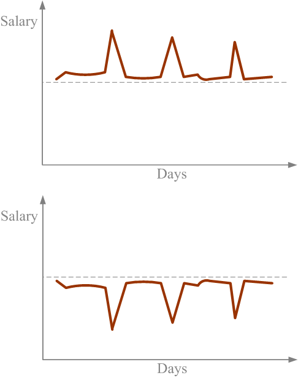

父母，特别是老妈，总是不舍得花钱。他们感觉花钱就是罪。每次叫他们给自己买点东西，他们总是说，挣钱不容易，以后还得用钱什么的。他们的理由之充分，让人很难攻破。近期看了奚恺元的两本书，看到几个点子。

一是，换成小钱。过年回家，别一次几千上万地给父母钱，这样他们一定会帮你存起来，留给你以后用。不如每次给100或200，这样的小钱会存在和那些大钱不同的“心理账户”中，他们会用这些钱来买菜或补贴家用什么的，起码是派上用场了。

二是，讲道理...这些年来，生活慢慢好起来了，本可以多花一些钱，让自己的生活好一点的。可是以前的习惯改不了了，还是像以前一样省吃俭用。这就像一些出租车司机会给自己定每天要完成的营业额，无论是生意好的下雨天，还是生意差一些的晴天，他们都在完成营业额之后就收工。这必然导致有时出门没多久就赚够了，有时到晚上很晚才能赚够当天的营业额。那为什么不在下雨天多跑多赚一点，生意不好的时候多休息一下呢？这样赚的钱不会差，而且还有机会休闲。感觉会更幸福一些。

生活好了，平常下下馆子，给自己买点喜欢的东西，不会给自己的经济状况有影响，而且还能让自己过得更好。为什么要受惯性的影响？
<h3>幸福学</h3>
幸福学是一门新的学科。它研究的是如何让人过得更爽。中国的GDP越来越高，可是中国人的幸福程度并没有像GDP那些增加。这个现象就是人们常常说的－“钱能带有幸福吗”。经济学研究的是怎么赚更多的钱，幸福学研究的是怎么得到更多的快乐。钱，只是我们的付出和幸福之间的一个媒介。有的人说，人生的目标是赚更多的钱，可是赚更多的钱又是为了什么？问到最后，我的答案是“为了更爽”。
<h3>审美疲劳</h3>
审美疲劳不是我们的错。这是因为情感有适宜性的关系。已婚的同学们寻外遇，包二奶，都是为了“追求幸福”（用引号是为了强调）。只是这种方式不被社会所喜爱。不被喜爱的原因是这些活动破坏了社会的Stability，即使没有法律，人们也会自发的通过舆论等方式压制这种行为（可是大家要是都接收这种行为，也不会破坏社会的Stability了）。最近的新闻里有个换偶教授，我理解他，他是在“追求幸福”。

在农场，有人曾制作形状像母牛生殖性的集精器为公牛采集精子。开始还好，过了一段时间就没什么用了。审美疲劳了嘛。当把集精器移动了一米之后，其采集到的量增加了80+%。这小小的改动之后就不疲劳了。

我们都会审美疲劳，但要找到一种被社会所接受的，不对他人产生伤害的方法来解决审美疲劳的问题
<h3>解除审美疲劳</h3>
要是你是要买房子。一个房子是100平米，一个是150平米，其他方面都一样。你是愿意买100平米的房子，然后用剩下来的钱去旅游几次（或几十次），还是买150平米的房子？在幸福学的角度来说，选择前者得到的快乐更多。

在买房子时，大房子和小房子的对比还强烈，大房子明显的好一些。这只是你的获得感受，是在联合评估（有比较）的情况下得到的。当你住到房子里时，你所得到的是消费感受，是在独立评估（没比较）下得到的。我家以前住120平米，现在住60平米，在学校里只有十几平米，还没独立卫生间，我没有感到明显的幸福上的差别。

所以，买了150平米的房子，这50平米所带来的快乐会很快被“审美疲劳”掉。可是，到不同地方去旅游的快乐却可以持续。50平米的空间就像是夜里传来的有规则的噪音，很容易被习惯，旅游就像是那些无规则的噪音，不容易被适应。

生活中就应该寻找不容易被适应的快乐，这样的快乐可以更持久。
<h3>快乐的薪水</h3>

上面的两种薪水，你愿意选哪种？第一个图中的薪水大部分时间维持在一个状态，有少数时间突然变得很高。第二个图中的薪水有时会变得很低。总的说来，第一个图中积累的薪水比第二个图高。

研究证明，第二个图中的薪水分布更能给人带来快乐。For example, 前段时间我拿同学的NOKIA N900来用，用了二天，被要了回去。再用回自己的6300的时候，那个失落啊，老想着用N900出去显摆的那段辉煌的时光（MM的目光~）。不过这样有个好处，就是会激励自己以后赚钱...

结论是，如果有自信以后会混得更好，就选择第一个图中的薪水分布。
<h3>别俗了，爽才是最重要的</h3>
排除以后混得好不好的事情先不说，上面议题中的两种薪水分布，大部分人会选择第一种，即累积薪水多的那一种。为什么不选择能得到最多快乐的分布？这就是因为世俗经济学。这种思维只考虑钱，没有考虑人的情感因素。

人们有遵循已有的规则而不去重新思考的惯性（因为在大多数情况下，这样做更有效率）。为什么在餐馆点菜时有了水煮鱼就不能再点个剁椒鱼头？如果两个鱼都有人喜欢吃并且都能吃完呢。他们都会吃得很爽。

活着到底是为了什么？幸福学如何不能给你答案，也能给你指条路。

