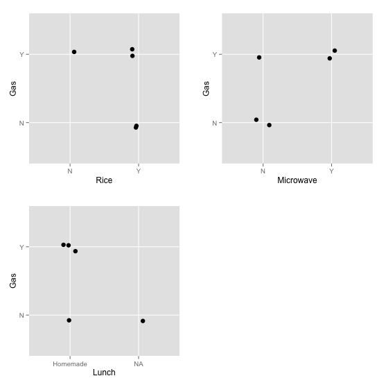

I have had gas problem for quite a while. Usually, right after I have lunch, gas starts to accumulate in my belly. Then comes the fart. It was really annoying, especially when you sat in the front row of a class. Sometimes it was even painful as there are too much gas in the belly that somehow couldn't get out.

Then I decided to find out the source of the gas and hoped I could stop the gas.

The first promising lead was from an article online, saying that microwaved starch may cause gas. Since I have microwaved homemade food with rice at work, I think that might be the problem. I started recording everyday whether I had rice, whether I microwaved rice, whether I had gas. Basically, I record two factors: rice and microwave. After five days, I looked at the data (not plotted at that time) and I realized that none of the two factors has correlation with gas, as shown below.

<a href="../images/5rows.png"></a>

I then realized my breakfast may have contributed to the gas. I hadn't realized it before that because the gas started right after lunch and it was easy to blame lunch. But in fact lunch could interact with breakfast in stomach or intestines and produce gas. Then I started to also record what I had for breakfast and switch to different breakfasts so I can see which one was responsible.

<a href="../images/plot.png"></a>

Now, although I don't know if it is the cereal, the milk or both that cause the problem, I know Cereal+Milk always led to gas and Dumplings never did from the bottom-right graph. Cereal+Milk interacted with my lunch and produced the gas.

Since then I have been having better afternoons.

Attached is the R script to reproduce the graphs.

```
library(ggplot2)
library(gridExtra)

data_text = "Date,Rice,Microwave,Gas,Lunch,Breakfast
4/8,Y,Y,Y,Homemade,NA
4/9,Y,N,N,NA,NA
4/10,Y,N,N,Homemade,NA
4/11,N,N,Y,Homemade,NA
4/12,Y,Y,Y,Homemade,NA
4/13,Y,Y,Y,Homemade,NA
4/14,N,N,Y,Restuarant,CerealMilk
4/15,Y,Y,Y,Homemade,CerealMilk
4/16,Y,N,N,Homemade,Dumpling
4/17,N,N,N,Restuarant,Dumpling
4/18,Y,N,N,Homemade,Dumpling
4/19,Y,Y,N,Homemade,Dumpling
4/22,N,N,N,Restuarant,Dumpling"

d = read.csv(text=data_text, header=T)

plot_one_factor <- function(d, factor_name)
{
    p = ggplot(d, aes_string(x=factor_name, y='Gas')) + 
        geom_jitter(size=3, position=position_jitter(width=0.1, height=0.1))
    return(p)
}

plotlist = list()
for (factor_name in c("Rice", "Microwave", "Lunch", "Breakfast")) {
    p = plot_one_factor(d, factor_name)
    plotlist = append(plotlist, list(p))
}
do.call('grid.arrange', c(plotlist, ncol=2))
```
